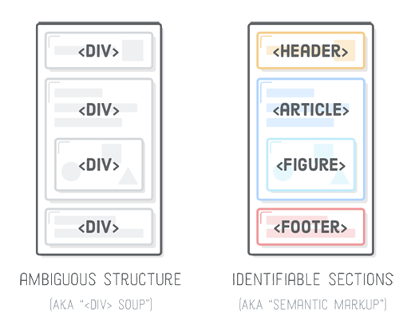
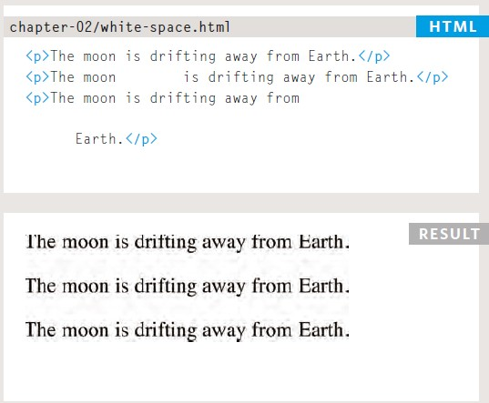
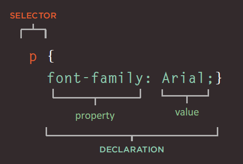
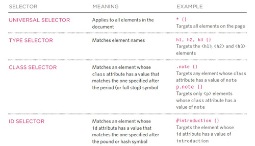
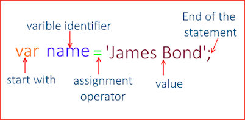
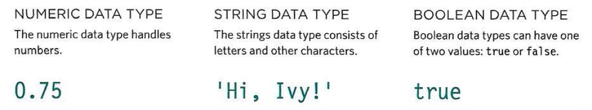
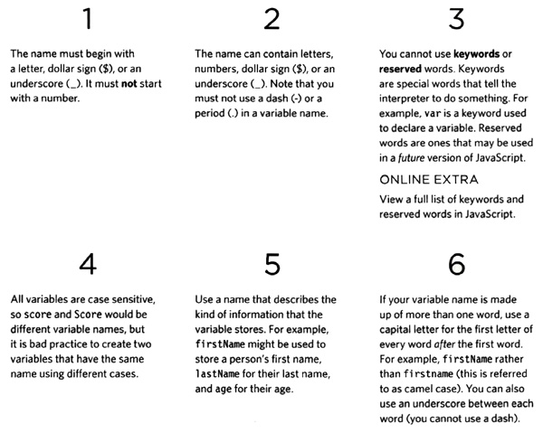

# **HTML & CSS (Ch2-Ch10) Notes:**

## Notes:
+ Semantic Markup don't affect the structure of the web page but add extra information so you know the type of element you insert.



+ White spaces or multiple spaces treated as a single space in HTML.



+ CSS rule contains two parts: selector and declaration, a declaration split into property and value. see the figure below:



+ There are many different types of CSS selector that allow you to target rules to specific elements in an HTML document, in the figure below some of them:



## Example:

> in this example we see a web page that have internal styling with different types of CSS selectors.

```html
<!DOCTYPE html>
<html>
  <head>
  <title>CSS Style</title>
  <style>
    *{  >>>> this is Universal Selector
      color: red;
    }

    h1{ >>>> this is Type Selector
      background: blue;
    }

    .div1{ >>>> this is Class Selector
      font-size: 15px;
    }

    div>p{  >>>> this is Child Selector
      color: green;
    }
  </style>
  </head>
  <body>
    <h1>this is heading</h1>
    <div class="div1"> this is div
      <p>this is paragraph<p>
    </div>
  </body>
</html>  
```

## Definitions list:
+ White space Collapsing >> treat the multiple spaces as single space.
+ Semantic markup >> provides extra information.
+ Structural markup >> the elements that you can use to describe both headings and paragraphs.
+ Block elements >> they start on a new line.
+ Inline elements >> they flow within the text and do not start on a new line.
+ Inheritance >> when apply some property to the parent element the child will be affected.

## Cheat sheet:

+ `<b>` Defines bold text
+ `<i>` Defines italic text
+ `<sup>` Defines a super-scripted text
+ `<sub>` Defines a sub-scripted text
+ `<br>` Inserts a single line break
+ `<hr>` Defines a horizontal rule
+ `<strong>` Defines strong text
+ `<em>` Defines emphasized text
+ `<link>` Defines a resource reference
+ `<style>` Defines a style definition

---
# **Javascript (Ch2-Ch4) Notes:**

## Notes:
+ Comments help make you codce easier, and they will not be excuted, there is two types of comments see the code below:

  ```javascript
  // single line comment

  /*
  multi line comment
  */
  ```
+ A variable in JavaScript consists of the following, see the figure below:



+ There is a lot of datatypes in JavaScript but the most popular ones, see the figure below:



+ Variables naming rules, see the figure below:



## Example:

```javascript
var paragraph = document.getElementById("p1");
paragraph.innerHtml = "new paragraph";
```
> In the example above we manipulate HTML element whic habe id=p1, and we change it's content to (new paragraph).

## Definitions list:

+ statement >> each step or instruction called statement and it ends with semicolon.
+ Variable >> used to store data.
+ String >> data type consists of letters or characters and it's written between quotes.
+ Boolean >>  data type which have two values true or false.
+ Array >> special type of variables which stores list of values. 
+ index >> number which each item in the array have and it's used to access that item.

## Cheat sheet:

+ `//` single line comment
+ `/* */` multi line comment
+ `var` variable declaring keyword
+ `let` variable declaring keyword
+ `const` constant declaring keyword
+ `document.getElementById()` access HTML element by it's id.
+ `var array = [1, 2, 3]` array example
+ `array.length` returns the number of elements in an array.
+ ```javascript
  if (condition) {
    //  block of code to be executed if the condition is true
  } else {
    //  block of code to be executed if the condition is false
  }
  ``` 
+ ```javascript 
  switch(expression) {
    case x:
      // code block
      break;
    case y:
      // code block
      break;
    default:
      // code block
  } 
  ```


[Back to home page](../README.md)