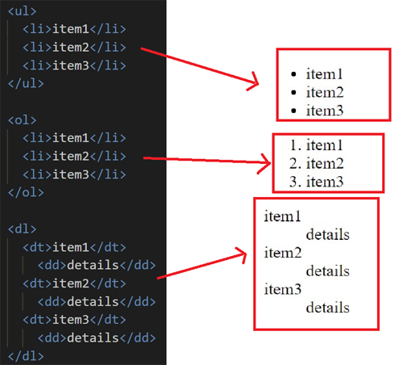
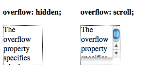

# **HTML & CSS (Ch3-Ch13) Notes:**

## Notes:

+ There is 3 types of lists used in HTML, see figure below:


+ We can specify the sizes (width, height) using pixels, percentage and ems. percentage and ems used when design a reponsive page.

+ min-width / max-width / min-height / max-height used in css to set a limit for the size of the element depending on the screen size of the device that show the site.

+ Overflow property have 2 values: hidden and scroll, see the figure below to understand the difference:


+ Every box in HTML have 3 properties: border, margin and padding, see the figure below to understand the difference: 


+ To center a box element on the page you need first to set a width of the element then set the margin left&right to auto.

+ Display property in css have 4 values: inline, inline-block, block and none.

## Example:

```css
p{
  width: 80%;
  margin: 10px auto 10px auto;
  border: 3px solid red;
  padding: 10px;
  display: inline-block;
}
```
> In this example we modify the paragraph element: **width and margin properties** use to center the element. **border property** used to draw a red border around the element. **padding** used to have some spaces between the content and the border. **display** used to change the box module. 

## Definitions list:

+ Ordered list >> the items of this list is ordered by incremening numbers.
+ Unordered lists >> the items of this list is ordered by bullets.
+ Definition lists >> the items of this list is ordered by the definition.
+ Nested Lists >> use s sub-list inside a list.
+ Limiting Width >> set the min-width and max-width of the element using css.
+ Limiting height >> set the min-height and max-height of the element using css.
+ overflow >> when the content is larger than the element itself.
+ Border >> area around the box element between the margin and the padding.
+ Margin >> outside area of the box element.
+ Padding >> area between the content and the border of the box element. 

## Cheat sheet:
### HTML:
+ `<ul>` Defines an unordered list
+ `<ol>` Defines an ordered list
+ `<dl>` Defines a definition list
+ `<dt>` Defines a definition term
+ `<dd>` Defines a definition description

### CSS:
+ `min-height` set the minimum height of box element
+ `max-height` set the maximum height of box element
+ `min-width` set the minimum width of box element
+ `max-width` set the maximum width of box element
+ `overflow` set how to deal with extra content
+ `border`  set a border around of box element 
+ `margin` set the outside area of box element
+ `padding`  set the inside area of box element
+ `visibility` set the element to visible or hidden
+ `display` change the box module of the box element
---
# **Javascript (Ch2-Ch4) Notes:**

## Notes:

+ Array is contain list of items related to each other, and there is two ways to write an array: literal and constructor, see the code below:
```javascript
// literal array
let arr1 = ['Ahmad','Yazan','Hassan'];
console.log(arr1[1]); // result = Yazan

// constructor array
let arr2 = new Array('Ahmad','Yazan','Hassan');
console.log(arr1.item(1)); // result = Yazan
```

## Example:
array change item and get the array length

## Definitions list:

+ literal array >> type of JS arrays where the values listed between square brackets.
+ constructor array >> type of JS arrays where the values listed between parentheses.

## Cheat sheet:
 


[Back to home page](../README.md)