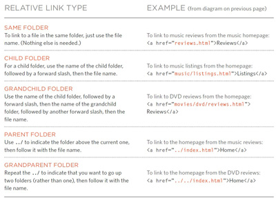

# **HTML & CSS (Ch4-Ch15) Notes:**

## Notes:

+ You can create a link to other site by decalring `<a href=''>` anchor tag with an attribute of `href` that holds the site URL.

+ Realtive URL have relations, see the figure below to understand:



+ To have a link that open email address we use href attribute start with (mailto), and also to open it on other tab you can use (target) attribute, see the code below:

```html
<a href="mailto:jon@example.org" target="_blank">Email Jon</a>
```

+ CSS position Schemes are: normal flow(static), relative, absolute and fixed.
  + **Static position**: is the default position where each element starts a new line even if there is a room beside other element.
  + **Relative position**: move the element in relation to the static position, then you can add offset (right, left) to move it horizontally, or offset (top, bottom) to move it vertically.
  + **Absolute position**: will take the element out of the normal flow(static) and will not affect the other elements positions(like it is not there), and here also you can add offset to move it.
  + **Fixed position**: It positions the element in relation to the browser window. so, when a user scrolls down the page, it stays in the exact same place, and to control where the fixed position element appears in relation to the browser window, the element offset properties are used.


## Example:

```css
h1{
  position: fixed;
  top: 0px;
}
```

> in the example above we make the (h1) element fixed on the screen, so when you scroll down the page the h1 will have a fixed place and you will stay see it.


## Definitions list:

+ **URL** >> Uniform Resource Locator.
+ **absolute URL** >>  the full web address for the site, and they have domain names.
+ **relative URL** >> the link to other page within the website, and they don't have domain names.
+ **Directories** >> folders on the website.
+ **root folder** >> folder contains all the website files and folders.
+ **index.html** >> default homepage of a site written in HTML.
+ **Parent Folder** >> the main folder that contain inside it other folders.
+ **Child Folder** >> the folder that it's inside other folder (parent).

## Cheat sheet:

### HTML:

+ `<a href='' taget='_blank>link</a>'` link that open in new tab.
+ `<a href="mailto:jon@example.org">Email </a>` link that opens and email.
+ `<a href='#top'>top</a>` link related to other tag in the same page.

### CSS:

+ `position` property determines the position of the element.

---
# **Javascript (Ch2-Ch4) Notes:**

## Notes:


## Example:


## Definitions list:
+ **** 


## Cheat sheet:


[Back to home page](../README.md)