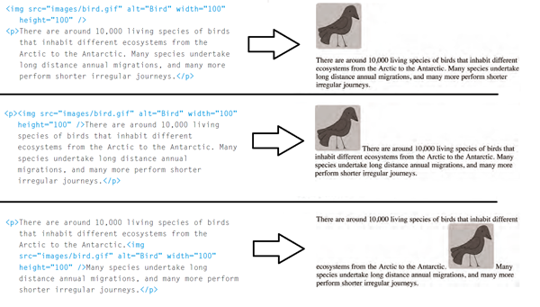
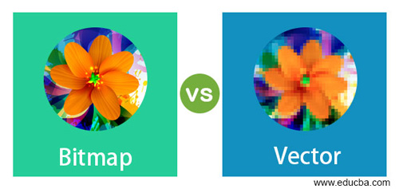
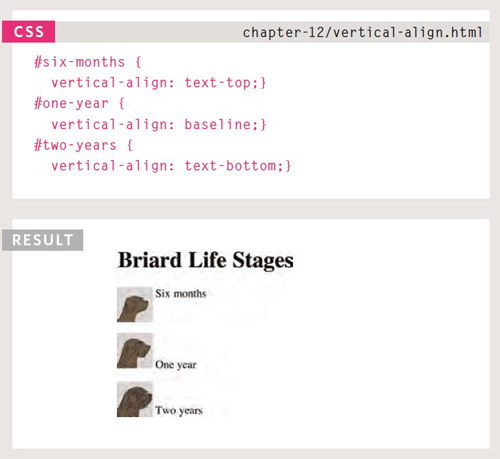

# **HTML & CSS (Ch5-Ch11-Ch12) Notes:**

## Ch5 Notes:

+ To add image to tour page you must use `` tag, and wit hthe following attributes:
  + src >> stand for source and it's the relative URL of the image.
  + alt >> stand for alternative and it's the text shown if the image broken.
  + title >> text shown when hover over the photo.  

```html

```

+ Because `` is inline element it can set withing block elements without start new line.


  
+ There is 3 rules to focus on when dealing with images:
  + Save the images in right format, websites usually use (jpeg, gif, or png).
  + Save Images at the right width and height.
  + Use correct resolution.

+ Use JPEG format when having many different colors in a picture, and use PNG or GIF if the picture have few colors or large areas of the same color.

+ Images created for the web should be saved at a resolution of 72 ppi. The higher the resolution of the image will not make it look better but it will increase hte time of loading becuase the size of the image will be biggar.

+ JPEG, PNG and GIF called **bitmap images** nad changing the dimension of the image will affect the quality of it, on the other hand SVG type images which called **vector images** is resolution-independent so you can change the dimensions of the image without affecting the quality of it.




+ `<figure>` tag used to contain images that share the same caption. `<figcaption>` used to add caption to an image.


## Ch11 Notes:

+ `color` property let you specify the font color, and `background-color` used to set the background color of the elements, and they both accept 3 values:
  + rgb values >> red,green,blue. The values from(0-255)
  + rgba values >> red,green,blue,alpha(opacity). opacity values from (0-1).
  + hsl values >> Hue,saturation,lightness. hue values (0-360). saturation values as %. lightness (0% white) (50% normal) (100% black).
  + hsla values >> Hue,saturation,lightness,alpha(opacity). 
  + HEX code (0-f)
  + Color name

```css
/* color name */
h1 {
color: white;
background-color: black;
}
/* hex code */
h2 {
color: #ff0000; /* this color is red */
background-color: #ffffff;  /* this color is white */
}
/* rgb value */
p {
color: rgb(0,255,0); /* this color is green */
background-color: #0000ff; /* this color is blue */
}
```  

## Ch12 Notes:

+ `font-family` property let you choose the typeface of the text.
+ `font-size` property let you choose the size of the text, and it accepts pixels and percentages and ems.
+ `@font-face` let you use font that the user doesn't have by download it from the web.

```css
@font-face {
font-family: 'ChunkFiveRegular';
src: url('fonts/chunkfive.eot');
}

h1, h2 {
font-family: ChunkFiveRegular;
}
```

+ `font-weight` property let you make the text **bold**, and it's have 2 values: normal and bold. 

+ `font-style` property let you make the text *italic*, and it's have 3 values: normal, italic and oblique.

+ `text-transform` property let you change the case of the text,  and it's have 3 values: uppercase (*uppercase all the text*), lowercase (*lowercase all the text*) and capitalize (*capitalize first letter only*).

+ `text-decoration` property let add one of these values: none (*remove the decoration*), underline, overline, line-through and blink (*animates the text to make it flash on and off*).

+ `line-height` property let you change vertical gap between lines of text.
+ `letter-spacing` property let you change the space between letters.
+ `word-spacing` property let you change the space between words. 
+ `text-align` property let you align the text with 4 values: right, left, center and justify.
+ `vertical-align` property let align text in respect to image.



+ `:first-letter` is a pseudo-element, let you control the properties of the first letter in the word.
+ `:first-line` is a pseudo-element, let you control the properties of the first line in the text.
+ `:link` is a pseudo-class, let you control the properties of the links that not visited.
+ `:visited` is a pseudo-class, let you control the properties of the links that are visited.
+ `:hover` is a pseudo-class, This is applied when a user hovers over an element with a pointing device such as a mouse.
+ `:active` is a pseudo-class, This is applied when an element is being activated by a user like a button or a link.
+ `:focus` is a pseudo-class, Focus occurs when a browser discovers that you are ready to interact with an element on the page like a form input when start typing.

---
# **Blog Post Notes:**

## Notes:


[Back to home page](../README.md)