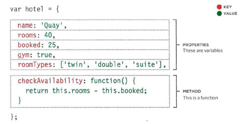
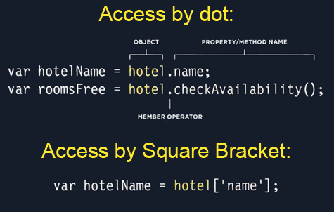
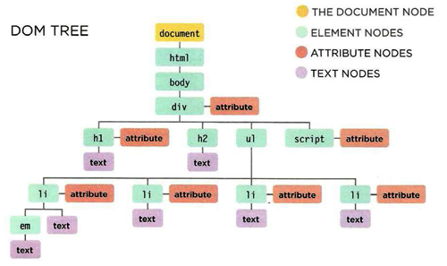
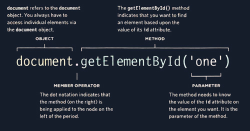
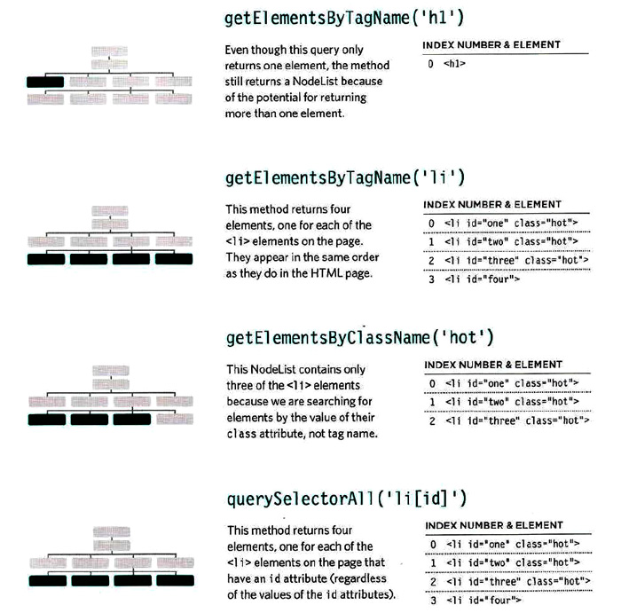

# **(Understanding The Problem Domain) Notes:**

+ Writing code is a lot like putting together a jigsaw puzzle, but the big issue is that many problem domains are like a puzzle with a blurry picture or no picture at all.
+ Programming is easy if you understand the problem domain.
+ If you want to make programming easier, you can do one of two things:
  + Make the problem domain easier
  + Get better at understanding the problem domain
  + Narrow your focus on a specific part of the problem.
  + Talk to customers or business people who know about the problem domain.    


---
# **Javascript (Ch3-Ch5) Notes:**

+ ## Ch3 (Object Literals) Notes:

  + Objects is a model of something in the real world and it's consists of variables (properties) and functions (methods).
  
  

  + To Access property or method of an object we type the name of the object followed by dot (called member operator). and you can accces the property (*not mehtod*) using square bracket.

   

+ ## Ch5 (DOM) Notes:

  + DOM is the Document Object Model, it determines how the browser should make a model of HTML page and how JS can access and change the content.
  + DOM tree is a model of the HTML page stored in the browser memory.
  + DOM tree have 4 types:
    + Document node, used to access all other types of nodes (element, attribute and text).
    + Element node, used to access specific element (attribute and text).
    + Attribute node, used to access elements attibutes.
    + Text node, used to access elements text.

   

  + To access elements of HTML we use DOM queries:
    + Select individual elements, use **getElementById()** or **querySelector()**.
    + Select Multiple elements, use **getElementsByClassName()** or **getElementsByTagName()** or **querySelctorAll()**.

  

  

  + Caching DOM queries means to save the result of the queries in a variable as a refrence to the location of that element in the DOM tree, this save the browser from looking again and again for the element.

  + To access specific element from nodelist, see the code below:

    ```javascript
    let elements = document.getElementsByClassName('hot'); // this will return array.
    let item1 = elements[0]; // access first array item
    let item2 = elements[1]; // access second array item
    ```
  
  + To select entire elements from nodelist, see the code below:

    ```javascript
    let Items = document.querySelectorAll('p.hot');

    for(let i=0; i < Items.length; i++){
      Items[i].className = 'cool';  // I give all the items class = cool
    }
    ```

  + Traversing the DOM means to access elements in relation to other element. examples of these properties: **parentNode, PreviousSibling, nextSibling, FirstChild & LastChild.**


[Back to home page](../README.md)