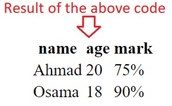
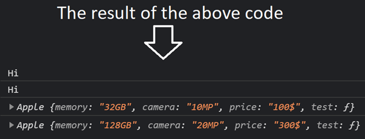

# **(Domain Modeling) Notes:**

+ Here's some tips to follow when building your own domain models using object-oriented programming (OOP):
  + When modeling a single entity that'll have many instances, build self-contained objects with the same attributes and behaviors.
  + Model its attributes with a constructor function that defines and initializes properties.
  + Model its behaviors with small methods that focus on doing one job well.
  + Create instances using the new keyword followed by a call to a constructor function.
  + Store the newly created object in a variable so you can access its properties and methods from outside.
  + Use the this variable within methods so you can access the object's properties and methods from inside.

---
# **HTML (Ch6 tables) Notes:**

+ The contents of the table are written out row by row. Example of HTML table:

```html
<table> <!--this tage used to create table-->
  <tr> <!--table row-->
    <th scope='col'>name</th> <!--table heading-->
    <th scope='col'>age</th>
    <th scope='col'>mark</th>
  </tr>
  <tr>
    <td>Ahmad</td> <!--table data-->
    <td>20</td>
    <td>75%</td>
  </tr>
  <tr>
    <td>Osama</td>
    <td>18</td>
    <td>90%</td>
  </tr>
</table>
```


+ HTML table attribute:
  + `scope='col'` used with `<th>` to indicate the the header in column
  + `scope='row'` used with `<th>` to indicate the the header in row
  + `colspan="here num of columns"` used with `<th>` and `<td>` indicates how many columns that cell should run across.
  + `rowspan="here num of rows "` used with `<th>` and `<td>` indicates how many rows that cell should run across.

+ `<thead>` and `<tbody>` and `<tfoot>` used for *long tables* to distinguish between different parts of the table, it helps to easy reading and easy styling the table.

---
# **Javascript (Ch3 Functions, Methods, and Objects) Notes:**

+ Object costructor can use a function as a **template** to create similar objects (**instances**), see example below:
```javascript
// Template:
function Apple(memory, camera, price){
  // properties:
  this.memory = memory;
  this.camera = camera;
  this.price = price;
  // Methods:
  this.test = function(){
    console.log('Hi')
  }
}

// instances:
let IphoneX = new Apple('128GB','20MP','300$');
let Iphone6 = new Apple('32GB','10MP','100$');
IphoneX.test();
Iphone6.test();
console.log(Iphone6);
console.log(IphoneX);
```


+ The code below show you how we add and remove properties from an object:
```javascript
let Hotel = {
  name: 'park',
  rooms: '120',
};
Hotel.gym = true; // thats how we add property to the object
delete Hotel.rooms; // thats how we remove property to the object
```
+ `this` keyword is a reference to the object that the function is created inside, if it's used in a **global functions** it will refer to the **window**, and the **global variable** is a property in the window object, so if you use `this.variable name` inside the global function it will access the global varibale.

+ Built-in objects is a toolkit comes with browser, and it have three types:
  1. browser object model, example (`window.screen.width`)
  1. document object model, example (`document.getElementById('')`)
  1. global javascript objects, example (`.toUpperCase` and `Math.PI()`)

+ Arrays are objects:
  + it's a key-value pair, key is the index.
  + array have properties like (length)
  + array have methods to add to it and remove from it.

+ Examples of the built-in objects:
> open this link to see the photo >>>> 
[built-in-objects](https://drive.google.com/file/d/19H2MlFer5cLK9oJfJG8fWRTz6o9HtKpV/view?usp=sharing)


[Back to home page](../README.md)