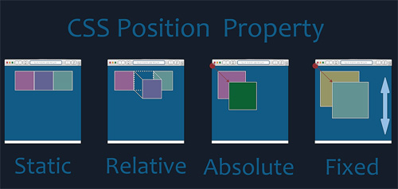
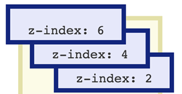
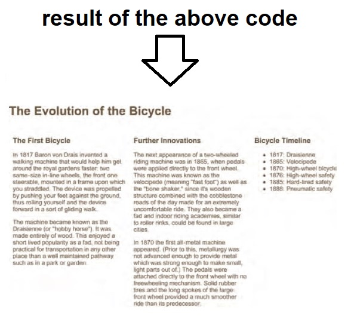
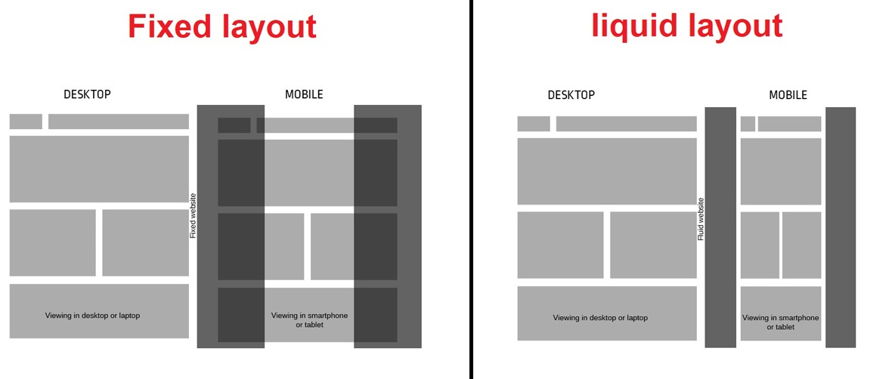

# **HTML/CSS ( Ch15 - Layout ) Notes:**

+ Block-level elements will start on a new line, examples: `<h1> <p> <ul> <li>`. Inline elements will flow in between surrounding text, examoles: ` <b> <i> <a>`

+ When you move any element from normal flow, boxes can overlap. The *z-index* property allows you to control which box appears on top.

+ CSS position Schemes are: normal flow(static), relative, absolute and fixed.
  + **Static position**: is the default position where each element starts a new line even if there is a room beside other element.
  + **Relative position**: move the element in relation to the static position, then you can add offset (right, left) to move it horizontally, or offset (top, bottom) to move it vertically.
  + **Absolute position**: will take the element out of the normal flow(static) and will not affect the other elements positions(like it is not there), and here also you can add offset to move it.
  + **Fixed position**: It positions the element in relation to the browser window. so, when a user scrolls down the page, it stays in the exact same place, and to control where the fixed position element appears in relation to the browser window, the element offset properties are used.



+ To control which element sits on top, you can use the `z-index` property. Its value is a number, and the higher the number the closer that element is to the front. For example, an element with a z-index of 10 will appear over the top of one with a z-index of 5.  



+ `float` property allows you to take an element in normal flow and place it as far to the left or right of the containing element as possible.

+ `clear` property allows you to say that no element (within the same containing element) should touch the left or right hand sides of a box. It can take the following values: left, right, both and none.

+ Example of creating 3 columns layout:

```html
<h1>The Evolution of the Bicycle</h1>
<div class="column1">
  h3>The First Bicycle</h3> ...
</div>
<div class="column2">
  <h3>Further Innovations</h3> ...
</div>
<div class="column3">
  <h3>Bicycle Timeline</h3> ...
</div> 
```

```css
.column1, .column2, .column3 {
  width: 300px;
  float: left;
  margin: 10px;
}
```



+ There is 2 types of layout:
  + **Fixed Width Layouts:** this one do not change size as the user increases or decreases the size of their browser window.
  + **Liquid Layouts:** this one stretch and contract as the user increases or decreases the size of their browser window.



+ CSS frameworks is useful to save you from repeatedly writing code for the same tasks. example of CSS framworks is *960.GS* which provides a style sheet that you can include in your HTML pages. Once our page links to this style sheet, you can provide the appropriate classes to your HTML code and it will create multiple column layouts for you.

+ Some developers split there CSS style into seperate sheets, one for layout and other for colors and fonts, there is 2 ways to add a multiple style sheets to a page:
  1. use `@import` in style.css file. 

    ```html
      <!DOCTYPE html>
      <html>
        <head>
          <title>Multiple Style Sheets - Import</title>
          <link rel="stylesheet" href="css/styles.css" />
        </head>
        <body>
          <!-- HTML page content here -->
        </body>
      </html>
    ```

    ```css
      /* this in style.css*/
      @import url("tables.css");
      @import url("typography.css");
    ```

  1. use links in the HTMl head for each style sheet

    ```html
      <!DOCTYPE html>
      <html>
        <head>
          <title>Multiple Style Sheets - Link</title>
          <link rel="stylesheet" href="css/site.css" />
          <link rel="stylesheet" href="css/tables.css" />
          <link rel="stylesheet" href="css/typography.css" />
        </head>
        <body>
          <!-- HTML page content here -->
        </body>
      </html>
    ```

[Back to home page](../README.md)