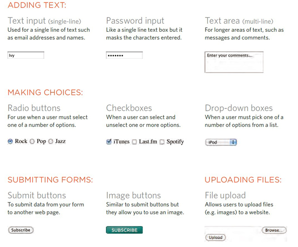
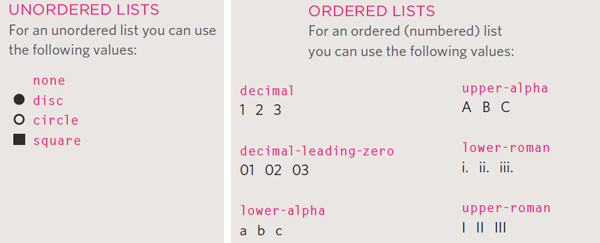
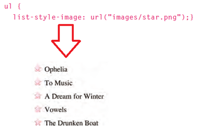
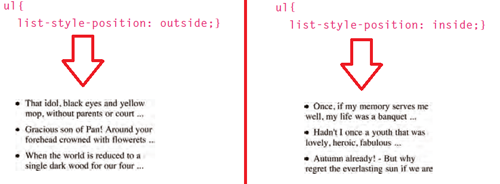
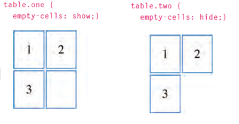
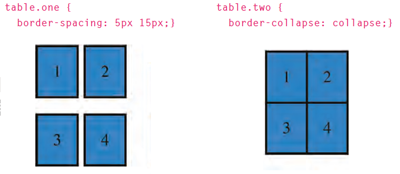

# **HTML & CSS (Ch7 - Ch14) Notes:**

## Ch7- Forms Notes:

+ Types of form, see figure below:



+ Form Structure:

  ```html
  <form action="http://www.example.com/subscribe.php" method="get">
    <!-- here where form controls written-->
  </form>
  ```
  > **action attribute** Its value is the URL for the page on the server that will receive the information in the form.

  > **method attribute** have two values get and post.

+ All form controls, open the link to see the photo:
[All form controls](https://drive.google.com/file/d/1aVy6MOs2bOsYElYP0QPkDxqtUcwrAPVI/view?usp=sharing)


## Ch14- lists,tables&forms Notes:

+ `list-style-type` property let you change the ahape of the points of `<ol>, <ul>, and <li>`, see photo below:



+ You can specify an image to act as a bullet point using the `list-style-image` property, see photo below:



+ `list-style-position` property indicates whether the marker should appear on the inside or the outside of the box, see photo below:



+ `empty-cells` property to specify whether the table empty cells borders should be shown or not, see photo below:



+ `border-spacing, border-collapse` properties used to control the distance between adjacent cells, see photo below:




---
# **JavaScript (Ch6 Events) Notes:**

 
[Back to home page](../README.md)