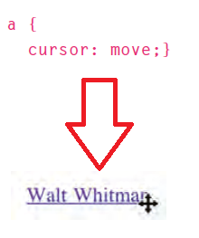

# **HTML & CSS (Ch7 - Ch14) Notes:**

## Ch7- Forms Notes:

+ Types of form, see figure below:


+ Form Structure:

  ```html
  <form action="http://www.example.com/subscribe.php" method="get">
    <!-- here where form controls written-->
  </form>
  ```
  > **action attribute** Its value is the URL for the page on the server that will receive the information in the form.

  > **method attribute** have two values get and post.

+ All form controls, open the link to see the photo:
[All form controls](https://drive.google.com/file/d/1aVy6MOs2bOsYElYP0QPkDxqtUcwrAPVI/view?usp=sharing)


## Ch14- lists,tables&forms Notes:

+ `list-style-type` property let you change the ahape of the points of `<ol>, <ul>, and <li>`, see photo below:


+ You can specify an image to act as a bullet point using the `list-style-image` property, see photo below:


+ `list-style-position` property indicates whether the marker should appear on the inside or the outside of the box, see photo below:


+ `empty-cells` property to specify whether the table empty cells borders should be shown or not, see photo below:


+ `border-spacing, border-collapse` properties used to control the distance between adjacent cells, see photo below:


+ `cursor` property allows you to control the type of mouse cursor, it have these values: auto,crosshair,default,pointer,move,text,wait,help and url("image").




---
# **JavaScript (Ch6 Events) Notes:**

+ Here is a selection of the events that occur in the browser while you are browsing the web. Any of these events can be used to trigger a function in your JavaScript code. **open the link to see the photo >>** 
[Events](https://drive.google.com/file/d/1w8S6esfAxnuMRB08nlgTi28AUEc5Z4it/view?usp=sharing)

+ There is 2 ways of Event handlers:
  + Traditional DOM event handler:

    ```javascript
      let button = document.getElementByld('btn1')
      button.onclick = function(){
        // code executed when the click event happen
      }
    ```
  + DOM event listeners:

    ```javascript
      let button = document.getElementByld('btn1')
      button.addEventlistener('click', function(){
        // code executed when the click event happen
      })
    ```
+ When an event occurs, the **event object** tells you information about the event, and the element it happened upon, see code below:

```javascript
function checkUsername(e) {
 let target = e.target ; //get target of event
};
let el = document.getElementByid('username');
el.addEventlistener('click', checkUsername);
```

> When the event object is passed into a function, it is often given the parameter name **e** (for event). It is a widely used shorthand.

+ `preventDefault()` is a method of the *event object* it prevent the default behavior of such elements because some events, such as clicking on links and submitting forms, take the user to another page.

+ When you use the *keydown or keypress* events, the event object has a property called **keyCode**, which can be used to tell which key was pressed. However, it does not return the letter for that key (as you might expect); it returns an *ASCII code* that represents the lowercase character for that key. If you want to get the letter or number as it would be displayed on the keyboard (rather than an ASCII equivalent), the **String object** has a built-in method called `fromCharCode()` which will do the conversion for you: `String.fromCharCode(event.keycode}`

[Back to home page](../README.md)