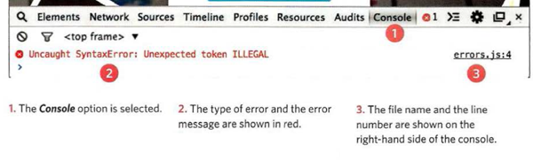
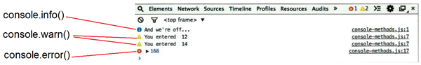
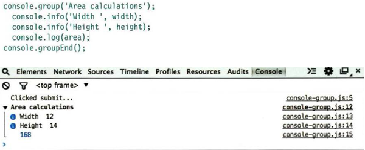

# **JavaScript (Ch10 Error Handling & Debugging) Notes:**

+ If a variable is declared outside a function, it can be used anywhere because it has **global scope**. and when a variable is declared within a function, it can only be used within that function and this is called **function-level scope or local scope.**

+ **hoisting** happen when calling a function before declaring it (in anonymous functions) and when assign a value a variable that has not yet been declared.

+ Best practice is to create variables inside the functions that use them.

+ Each execution context also creates its own **variables object**. This object contains details of all of the variables, functions, and parameters for that execution context. 
> note that you cannot access this variables object from your code; it is something the interpreter is creating and using behind the scenes.

+ If error happen inside a function for example the interpreter will go through the stack looking for error handling code until it gets to the global context. If there is still no error handler, the script stops running and the **Error object** is created.

+ To deal with errors:
  1. **Debug the script to fix errors:** will need to debug the code, track down the source of the error, and fix it using developer tools like console.
  2. **Handle errors gracefully:** You can handle errors gracefully using try, catch, throw, and finally statements. and thats useful when the error reason is beyond your control.

+ **The console** is one of *developer tools* that will tell you when there is a problem with a script where to look for the problem, and what kind of issue it seems to be.

  

+ In your javascript code you can use console object to debug the code by using The `console.log()` method.

+ There is more console methods to use and They use various colors and icons to distinguish them, see figure below:

  

+ If you want to write a set of related data to the console, you can use the `console.group()` method to group the messages together, see figure below:

  

+ Using the `console.assert()` method, you can test if a condition is met, and write to the console only if the expression evaluates to false. 

+ You can pause the execution of a script on any line using **breakpoints.**

+ You can auto create a breakpoint in your code using just the **debugger** keyword inside your code adn then when the developer tools are open, this will automatically create a breakpoint.

+ If you know your code might fail, use `try, catch, and finally`. Each one is given its own code block.
  + `try` check If an exception occurs in this section of code, control is automatically passed to the corresponding **catch** block. If you use a `continue, break, or return` keyword inside a try, it will go to the **finally** option.

  + `catch` If the try code block throws an exception, catch steps in with an alternative set of code.

  + `finally` code block will run whether the try block succeeded or failed.

  ```javascript
    try {
      // Try to execute this code
    }catch (exception) {
      // If there is an exception, run this code
    }finally {
      // This always gets executed
    }
  ```


[Back to home page](../README.md)