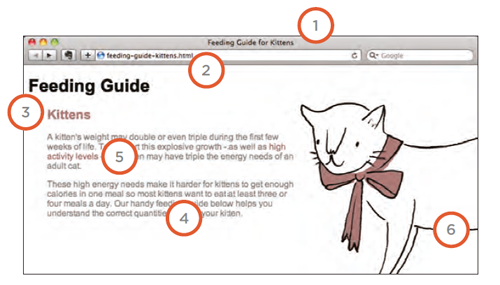

# **HTML & CSS (Ch16 - Ch19) Notes:**

## Ch16 - Images Notes:

+ You can control the size of the image using `width` and `height` properties in CSS.

+ To center the image:
  1. Change the image display to `block`.
  2. Choose one of these 2 ways:
     + On the containing element, you can use the `text-align` property with a value of `center`.
     +  On the image itself, you can use the use the `margin` property and set the values of the `left and right margins to auto`.

+ The `background-image` property allows you to place an image *behind any HTML element.*
+ `background-repeat` property help control repetition of the background image and it have 4 values: repeat,repeat-x,repeat-y and no-repeat. 
+ `background-attachment` property control whether a background image should stay in one position or move as the user scrolls and it have 2 values: fixed nad scroll.
+ `background-position` property to specify where in the browser window the background image should be placed and it have 2 pair values *The first represents the horizontal position and the second represents the vertical*.

  ```css
  /* these two setting have the same result*/
  body {
    background-position: center center;
    background-position: 50% 50%;
    }
  ```

+ When a single image is used for several different parts of an interface, it is known as a **sprite**, and this donr by change the background position whne hover or when click. The advantage of using sprites is that the web browser only needs to request one image rather than many images, which can make the web page load faster.

## Ch19 - Practical Information Notes:

+ Search engine optimization (or SEO) is the practice of trying to help your site appear nearer the top of search engine results when people look for the topics that your website covers.

+ **On-page techniques** are the methods you can use on your web pages to improve their rating in search engines. like: writing a searching keywords in HTML and giving a good name to images in `alt` attribute.

+ **Off-Page Techniques** search engines help determine how to rank your site by looking at the number of other sites that link to yours. like: words between `<a>` and `</a>`if the text in the link contains keywords (rather than just click here or your website address) it may be considered more relevant.

+ To improve its findability there is 7 places where keywords can appear:
  1. page title.
  2. web address.
  3. Headings.
  4. Text.
  5. Link Text.
  6. Image Alt Text.
  7. Page Descriptions. lives inside the `<head>` element and is specified using a `<meta>` tag.

   

+ **Google Analytics** is a free service tool to analyze how people found your site, what they were looking at and at what point they are leaving.  

+ In order to put your site on the web you will need:
  1. **Domain name:** is your web address (e.g. google.com or bbc. co.uk). There are many websites that allow you to register domain names. Usually you will have to pay an annual fee to keep that domain name.
  2. **Web hosting:** upload your website to a web server so the people can reach it.

+  To transfer your code and images from your computer to your hosting company, you use something known as **File Transfer Protocol (FTP).** 

[Back to home page](../README.md)