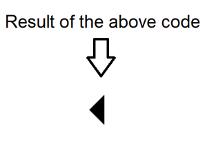
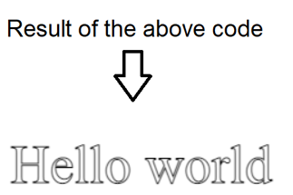

# **Chart.js Notes:**

+ Charts are better for displaying data visually than tables.

+ To draw a charts we use Chart.js, a JavaScript plugin that uses HTML5’s canvas element to draw the graph onto the page.

+ Steps of adding a chart to your website:
  1. download Chart.js and import it in the HTML page.
  2. create a canvas element in your HTML.
  3. start coding on JS see this for more info [EASILY CREATE STUNNING ANIMATED CHARTS WITH CHART.JS](https://www.webdesignerdepot.com/2013/11/easily-create-stunning-animated-charts-with-chart-js/)


# **Canvas API Notes:**

+ `<canvas>` element look like `` element but it doesn't have `src and alt` attributes, it only have two attributes `width and height`. and it requires the closing tag `</canvas>`.

+ The `<canvas>` element can be styled just like any normal image (margin, border, background…).

+ `getContext(2d)` used to access the drawing context for *2D graphics*.

+ There are three functions that draw rectangles on the canvas: 
  + `fillRect(x, y, width, height)` Draws a filled rectangle.
  + `strokeRect(x, y, width, height)` Draws a rectangular outline.
  + `clearRect(x, y, width, height)` Clears the specified rectangular area, making it fully transparent.

  > x and y specify the position on the canvas (relative to the origin) of the top-left corner of the rectangle. width and height provide the rectangle's size.

+ `beginPath()` Creates a new path.
+ `closePath()`Adds a straight line to the path, going to the start of the current sub-path.
+ `stroke()`Draws the shape by stroking its outline.
+ `fill()` Draws a solid shape by filling the path's content area.
+ `moveTo(x, y)` Moves the pen to the coordinates specified by x and y.
+ `lineTo(x, y)` Draws a line from the current drawing position to the position specified by x and y.

+ Example:

  ```javascript
    function draw() {
      var canvas = document.getElementById('canvas');
      if (canvas.getContext) {
        var ctx = canvas.getContext('2d');

        ctx.beginPath();
        ctx.moveTo(75, 50);
        ctx.lineTo(100, 75);
        ctx.lineTo(100, 25);
        ctx.fill();
      }
    }
  ```

  

+ `fillStyle = color` Sets the style used when filling shapes.
+ `strokeStyle = color` Sets the style for shapes' outlines.
+ `globalAlpha = transparencyValue` Applies the specified transparency value to all future shapes drawn on the canvas. The value must be between 0.0 (fully transparent) to 1.0 (fully opaque). This value is 1.0 (fully opaque) by default.

+ `fillText(text, x, y [, maxWidth])` Fills a given text at the given (x,y) position. Optionally with a maximum width to draw.
+ `strokeText(text, x, y [, maxWidth])` Strokes a given text at the given (x,y) position. Optionally with a maximum width to draw.

+ Example:

  ```javascript
    function draw() {
      var ctx = document.getElementById('canvas').getContext('2d');
      ctx.font = '48px serif';
      ctx.fillText('Hello world', 10, 50);
    }
  ```

  


[Back to home page](../README.md)