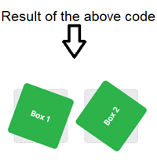
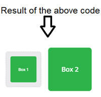
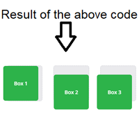
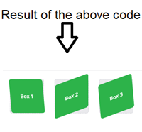
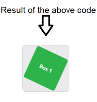

# **Transforms Article Notes:**

+ To make sure that the browser support the transform property use **prefixs** before the property name.

  

  + example of the prefix use:

    ```css
      button{
        -webkit-transform: scale(1.2);
        -moz-transform: scale(1.2);
        -o-transform: scale(1.2);
      }
    ```

+ `rotate` value accept from 0-360deg, and if positive it will rotate clockwise and if negative counterclockwise. see example below:

  ```css
    .image1{
      transform: rotate(20deg);
    }
    .image2{
      transform: rotate(20deg);
    }
  ```

   

+ `scale` value controls the size of the element, 1 is the default value, >1 will enlarge and <1 will shrink. see example below:

  ```css
    .image1{
      transform: scale(.6);
    }
    .image2{
      transform: scale(1.20);
    }
  ```

    

  > It is possible to scale only the height or width of an element using the **scaleX and scaleY** values.


+ `translate` value moves element in x&y axis, see example below:

  ```css
    .image1{
      transform: translateX(-10px);
    }
    .image2{
      transform: translateY(25%);
    }
    .image3{
      transform: translate(-10px, 25%);
    }
  ```

   

+ `skew` value controls the distortion of an element, see example below:

  ```css
    .image1{
      transform: skewX(5deg);
    }
    .image2{
      transform: skewY(-20deg);
    }
    .image3{
      transform: skew(5deg, -20deg);
    }
  ```

  

+ You can use multiple tranform values at once, see example below:

  ```css
    .image1{
      transform: rotate(25deg) scale(.75);
    }
  ```

  


+ The default transform origin is the center of an element, both 50% horizontally and 50% vertically, you can change that see examples:
  + `transform-origin: 0 0` top left or `transform-origin: top left`
  + `transform-origin: 100% 100%` bottom right


[Back to home page](../README.md)