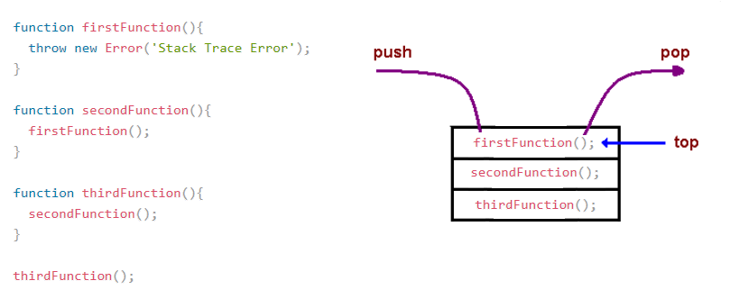

# **Understanding the JavaScript Call Stack:**

- **What is a ‘call’?**

  Is a function invocation.

- **How many ‘calls’ can happen at once?**

  One at a time.

- **What does LIFO mean?**

  Last In, First Out and it means that the last function that gets pushed into the stack is the first to be pop out, when the function returns.(1)

- **Draw an example of a call stack and the functions that would need to be invoked to generate that call stack.**

  

- **What causes a Stack Overflow?**

  stack overflow happens when a function that calls itself without an exit point.

# **JavaScript error messages:**

- **What is a ‘refrence error’?**

  When you use a variable that is not declared.

- **What is a ‘syntax error’?**

  When something cannot be parsed in terms of syntax.

- **What is a ‘range error’?**

  When manipulate an object with some kind of length and give it an invalid length.

- **What is a ‘type error’?**

  When the types (number, string...) you are trying to use are not the same.

- **What is a breakpoint?**

  breakpoint is to select a line so you will be able to see what has happened before that point and you can try and evaluate the next lines to check if everything is outputting what you are expecting.(2)

- **What does the word ‘debugger’ do in your code?**

  Debugger is other way to put breakpoint, and you can putting it in statement in your code in the line you want to break (code execution stop)

---

## Things I want to know more about:

- How async affect the call stack?
- Is there is other ways to handle errors that try/catch?

## Sources:

- (1) [The JavaScript Call Stack](https://www.freecodecamp.org/news/understanding-the-javascript-call-stack-861e41ae61d4/)

- (2) [JavaScript error messages](https://codeburst.io/javascript-error-messages-debugging-d23f84f0ae7c)

  [Back to home page](../README.md)
