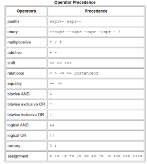

# **Java Basics:**

- **Variables:**

  - Kinds of variables:(1)

    - Instance Variables (Non-Static Fields): There values are unique to each instance (object) of a class, and they are declared without `static` keyword.

    - Class Variables (Static Fields): Variable declared with `static` keyword and apply to all instances (objects).

    - Local Variables: Variables declared inside a method, they have no keywords, and they can't be accessed from outside the method.

    - Parameters: Variables declared between the parentheses of the method.

  - Best practice in naming a variable is to start with letter not $ or \_ and to use full word instead of single letter and to use camelcase convention.

- **Operators:** (1)

  

- **Expressions, Statements, and Blocks:**

  - An expression is a construct made up of variables, operators, and method invocations, example: (1)

    ```java
      int number = 0;
    ```

  - Statement types:

    - expression statements:

      ```java
       System.out.println("Hello World!");
      ```

    - declaration statements:

      ```java
       double Value = 5.2;
      ```

    - control flow statements:

      ```java
       while(condition){
         // code
       }
      ```

  - Block example:

    ```java
       if (condition) { // begin block 1
            System.out.println("Condition is true");
        } // end block one
    ```

- **Control Flow Statements:**

  - Control Flow Statements enable your program to conditionally execute particular blocks of code.(1)

  - decision-making statements: **(if-then, if-then-else, switch)**.
  - looping statements: **(for, while, do-while)**.
  - branching statements: **(break, continue, return)**.

# **What does it mean to compile code:**

- The computer language is (machine language) which is a series of 1's and 0's.

- Because it hard for humans to read machine language (0 & 1) they made a higher level languages like java and c#.

- The compiler takes the human code and covert it to machine language.

- If the code compiles that doesn't mean it's right ot it will work.

# **Reading Java Documentation:**

- > Java has a standard Application Programming Interface —a huge library consisting of over 4,000 classes.(2)

- Use this link to srearch in java API documentation >> [docs.oracle.com/javase/8/docs/api/.](docs.oracle.com/javase/8/docs/api/.)

---

## Sources:

- (1) [java Language Basics](https://docs.oracle.com/javase/tutorial/java/nutsandbolts/index.html)

- (2) [Reading Java Documentation](https://www.dummies.com/programming/java/making-sense-of-javas-api-documentation/)

[Back to home page](../README.md)
