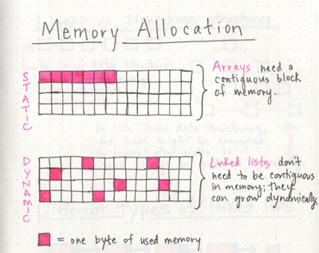
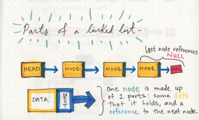
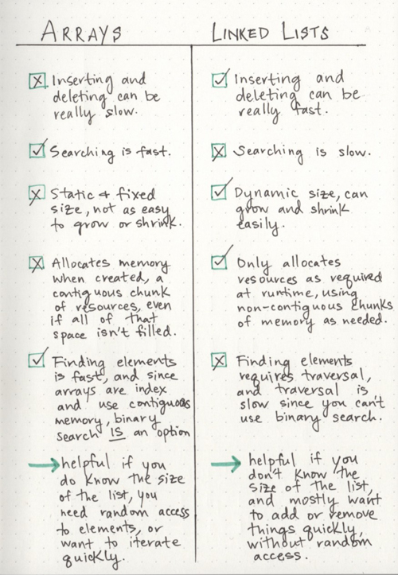

# **Linked Lists:**

- > A Linked List is a data structure that contains nodes that links/points to the next node in the list.(1)

- There are two types of Linked List:(1)

  - Singly - Singly refers to the number of references the node has. A Singly linked list means that there is only one reference, and the reference points to the Next node in a linked list.
  - Doubly - Doubly refers to there being two (double) references within the node. A Doubly linked list means that there is a reference to both the Next and Previous node.

- Head is a reference to the first node in a linked list.

- We can't use foreach or for loop to iterate throught the linked list rather we depend on the next value of each node.

# **What’s a Linked List, Anyway?:**

- > One characteristic of linked lists is that they are linear data structures, which means that there is a sequence and an order to how they are constructed and traversed.(2)

- hashes, Trees and graphs are examples of implementing non-liner data structures (items don’t have to be arranged in order, which means that we could traverse the data structure non-sequentially).

- Unlike arrays, linked list doesn’t need memory all in one place. One byte could live somewhere, while the next byte could be stored in another place in memory altogether! Linked lists don’t need to take up a single block of memory; instead, the memory that they use can be scattered throughout.(2)

  

- A linked list is made up of a series of nodes, which are the elements of the list.

  

- > A node only knows about what data it contains, and who its neighbor is.(2)

- One way to think about Big O notation is a way to express the amount of time that a function, action, or algorithm takes to run based on how many elements we pass to that function.(3)

- To insert an element into a linked list:(3)

  - First, we find the head node of the linked list.
  - Next, we’ll make our new node, and set its pointer to the current first node of the list.
  - Lastly, we rearrange our head node’s pointer to point at our new node.

- To insert an element at the end of a linked list:(3)

  - Find the node we want to change the pointer of (in this case, the last node)
  - Create the new node we want to insert and set its pointer (in this case, to null)
  - Direct the preceding node’s pointer to our new node

- > a linked list is usually efficient when it comes to adding and removing most elements, but can be very slow to search and find a single element.(3)

- Link list vs arrays: (3)

  

---

## Sources:

- (1) [Linked Lists](https://codefellows.github.io/common_curriculum/data_structures_and_algorithms/Code_401/class-05/resources/singly_linked_list.html)

- (2) [What’s a Linked List, Anyway? [Part 1]](https://medium.com/basecs/whats-a-linked-list-anyway-part-1-d8b7e6508b9d)

- (3) [What’s a Linked List, Anyway? [Part 2]](https://medium.com/basecs/whats-a-linked-list-anyway-part-2-131d96f71996)

[Back to home page](../README.md)
