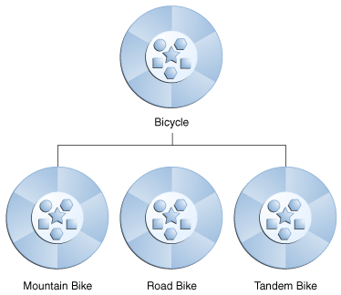

# **Java OO Tutorial:**

- OOP allows classes to inherit commonly used state (field) and behavior (method) from other classes, example:(1)

  ```java
  class MountainBike extends Bicycle {

  // new fields and methods defining
  // a mountain bike would go here

  }
  ```

  **MountineBike** is a class that inherit from **Bicycle** class, the MountineBike called (subclass or child) and Bicycle called (superclass or parent).

  

- An **interface** is a group of related methods with empty bodies, example:(1)

  ```java
  interface Bicycle {

    //  wheel revolutions per minute
    void changeCadence(int newValue);

    void changeGear(int newValue);

    void speedUp(int increment);

    void applyBrakes(int decrement);
  }

  // To implement the interface above:

  class ACMEBicycle implements Bicycle {

    int cadence = 0;
    int speed = 0;
    int gear = 1;

   // The compiler will now require that methods
   // changeCadence, changeGear, speedUp, and applyBrakes
   // all be implemented. Compilation will fail if those
   // methods are missing from this class.

    void changeCadence(int newValue) {
         cadence = newValue;
    }

    void changeGear(int newValue) {
         gear = newValue;
    }

    void speedUp(int increment) {
         speed = speed + increment;
    }

    void applyBrakes(int decrement) {
         speed = speed - decrement;
    }
  }
  ```

- > If your class claims to implement an interface, all methods defined by that interface must appear in its source code before the class will successfully compile.(1)

- Because software written in the Java programming language can be composed of hundreds or thousands of individual classes, it makes sense to keep things organized by placing related classes and interfaces into **packages**.(1)

- The Java platform provides an enormous class library (a set of packages) suitable for use in your own applications. This library is known as the "Application Programming Interface", or "API" for short. Its packages represent the tasks most commonly associated with general-purpose programming (String, File, Socket).(1)

# **Java Inheritance & Interfaces Tutorial:**

- The idea is when you want to create a new class and there is already a class that includes some of the code that you want, you can derive your new class from the existing class. In doing this, you can reuse the fields and methods of the existing class without having to write them yourself.(2)

- > Constructors are not members(fields, methods), so they are not inherited by subclasses, but the constructor of the superclass can be invoked from the subclass.

- > A subclass inherits all of the public and protected members of its parent, no matter what package the subclass is in. If the subclass is in the same package as its parent, it also inherits the package-private members of the parent. You can use the inherited members as is, replace them, hide them, or supplement them with new members(2).

---

## Sources:

- (1) [Object-Oriented Programming Concepts](https://docs.oracle.com/javase/tutorial/java/concepts/)

- (2) [Interfaces and Inheritance](https://docs.oracle.com/javase/tutorial/java/IandI/index.html)

[Back to home page](../README.md)
