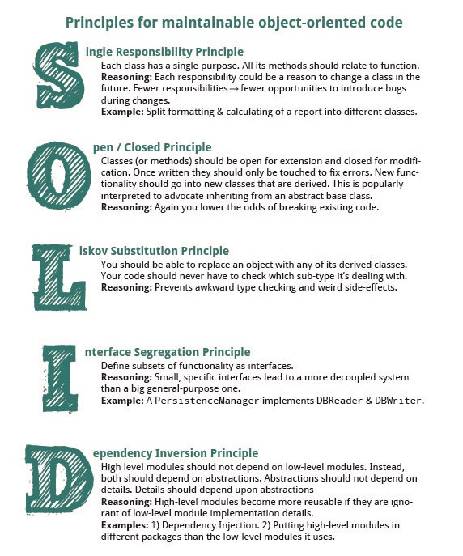

# **SOLID principles intro:**

- SOLID stands for:(1)

  - S -> Single-responsiblity Principle
  - O -> Open-closed Principle
  - L -> Liskov Substitution Principle
  - I -> Interface Segregation Principle
  - D -> Dependency Inversion Principle

- Adopting SOLID principles can contribute in avoiding code smells, refactoring code, and Agile or Adaptive software development.(1)

- **Single-Responsibility Principle** means that the method should only do one job.

- **Open-Closed Principle** means that a class should be extendable without modifying the class itself.

- **Liskov Substitution Principle** means that every subclass or derived class should be substitutable for their base or parent class.

- **Interface Segregation Principle** means clients shouldn’t be forced to depend on methods they do not use.

- **Dependency Inversion Principle** high-level module must not depend on the low-level module, but they should depend on abstractions.

# **OO SOLID principles in real life:**

## 

## Sources:

- (1) [SOLID: The First 5 Principles of Object Oriented Design](https://www.digitalocean.com/community/conceptual_articles/s-o-l-i-d-the-first-five-principles-of-object-oriented-design)

- (2) [The SOLID Principles in Real Life](https://dzone.com/articles/the-solid-principles-in-real-life)

[Back to home page](../README.md)
