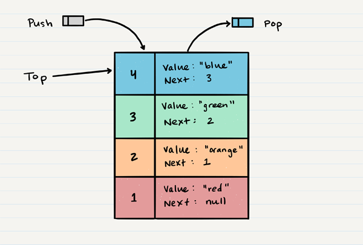
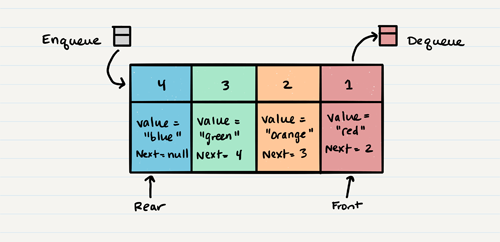

# **Stacks and Queues:**

- > A stack is a data structure that consists of Nodes. Each Node references the next Node in the stack, but does not reference its previous(1).

- Common terminology for a stack is:(1)

  - Push - Nodes or items that are put into the stack are pushed
  - Pop - Nodes or items that are removed from the stack are popped.
  - Top - This is the top of the stack.
  - Peek - When you peek you will view the value of the top Node in the stack.
  - IsEmpty - returns true when stack is empty otherwise returns false.

- Stacks follow these concepts:(1)

  - FILO >> First In Last Out, means that the first item added in the stack will be the last item popped out of the stack.

  - LIFO >> Last In First Out, means that the last item added to the stack will be the first item popped out of the stac

- 

- Common terminology for a queue is:(1)

  - Enqueue - Nodes or items that are added to the queue.
  - Dequeue - Nodes or items that are removed from the queue. If called when the queue is empty an exception will be raised.
  - Front - This is the front/first Node of the queue.
  - Rear - This is the rear/last Node of the queue.
  - Peek - When you peek you will view the value of the front Node in the queue. If called when the queue is empty an exception will be raised.
  - IsEmpty - returns true when queue is empty otherwise returns false.

- Queues follow these concepts:(1)

  - FIFO >> First In First Out, means that the first item in the queue will be the first item out of the queue.

  - LILO >> Last In Last Out, means that the last item in the queue will be the last item out of the queue.

- 

## Sources:

- (1) [Stacks and Queues](https://codefellows.github.io/common_curriculum/data_structures_and_algorithms/Code_401/class-10/resources/stacks_and_queues.html)

[Back to home page](../README.md)
