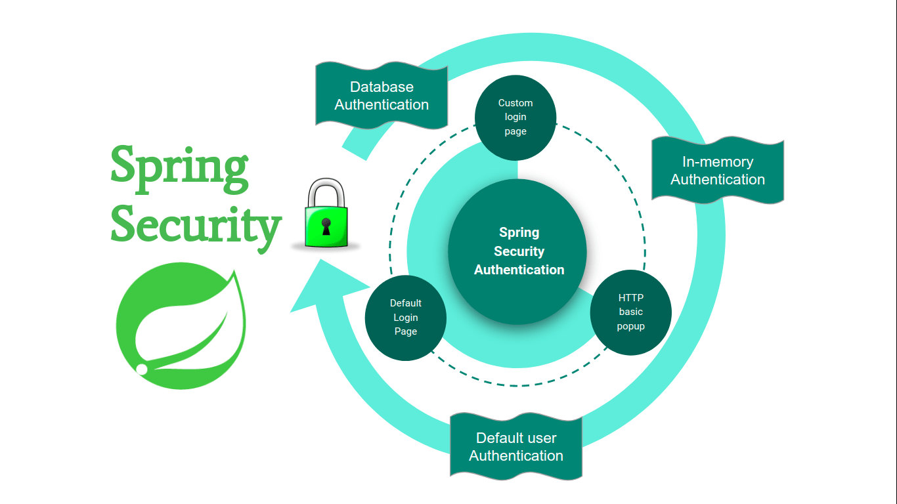

# **Spring Security overview:**

- Authentication (who are you?) and Authorization (what are you allowed to do?).

- Spring Security is really just a bunch of servlet filters that help you add authentication and authorization to your web application. It also integrates well with frameworks like Spring Web MVC (or Spring Boot), as well as with standards like OAuth2 or SAML.

- Spring Security is the primary choice for implementing application-level security in Spring applications. Generally, its purpose is to offer you a highly customizable way of implementing authentication, authorization, and protection against common attacks.

  

- for more info >> [Spring Security overview](https://spring.io/guides/topicals/spring-security-architecture/)

## Sources:

- (1) [Spring Security overview](https://spring.io/guides/topicals/spring-security-architecture/)

- (2) [Spring Auth cheat sheet](https://github.com/codefellows/seattle-java-401d2/blob/master/SpringAuthCheatSheet.md)

[Back to home page](../README.md)
