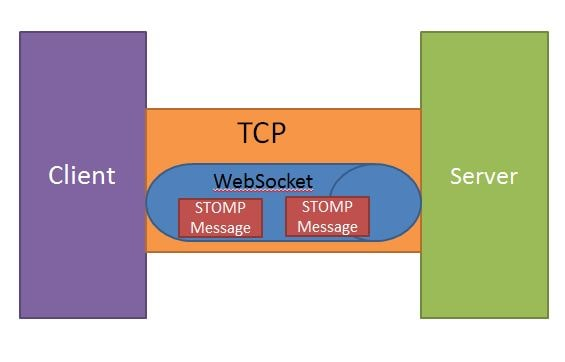

# **Real time messaging with websockets:**

- WebSocket is a thin, lightweight layer above TCP. This makes it suitable for using “subprotocols” to embed messages.(1)

- WebSockets is a bi-directional, full-duplex, persistent connection between a web browser and a server. Once a WebSocket connection is established the connection stays open until the client or server decides to close this connection

- STOMP messaging with Spring to create an interactive web application. STOMP is a subprotocol operating on top of the lower-level WebSocket.(1)

- WebSockets allow for a higher amount of efficiency compared to REST because they do not require the HTTP request/response overhead for each message sent and received.

- For more info check >>> [Using WebSocket to build an interactive web application](https://spring.io/guides/gs/messaging-stomp-websocket/)

## Sources:

- (1) [Using WebSocket to build an interactive web application](https://spring.io/guides/gs/messaging-stomp-websocket/)

[Back to home page](../README.md)
