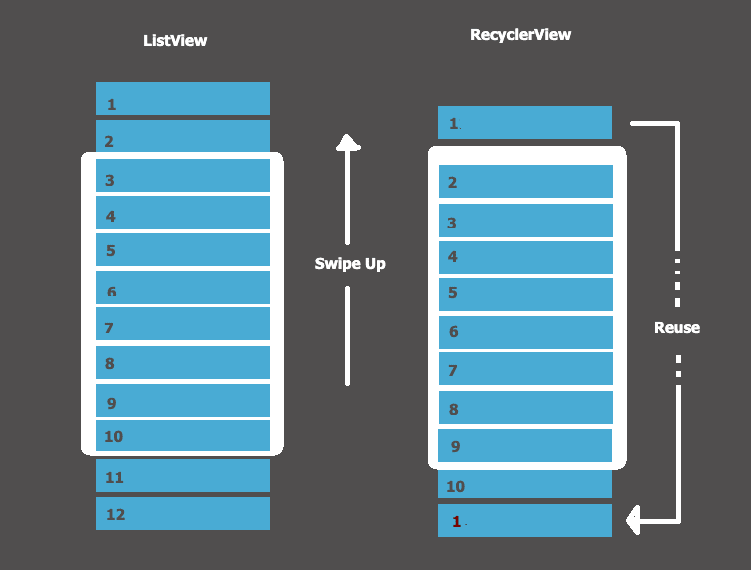

# **RecyclerView for displaying lists of data:**



- RecyclerView makes it easy to efficiently display large sets of data. You supply the data and define how each item looks, and the RecyclerView library dynamically creates the elements when they're needed.(1)

- Classes needed to build your dynamic list:

  - **RecyclerView**.
  - **RecyclerView.ViewHolder**.
  - **RecyclerView.Adapter**.
  - **LayoutManager**.

- Steps for implementing your RecyclerView: (1)

  - First of all, decide what the list or grid is going to look like. Ordinarily you'll be able to use one of the RecyclerView library's standard layout managers.

  - Design how each element in the list is going to look and behave. Based on this design, extend the ViewHolder class. Your version of ViewHolder provides all the functionality for your list items. Your view holder is a wrapper around a View, and that view is managed by RecyclerView.

  - Define the Adapter that associates your data with the ViewHolder views.

- Here's an example of a simple adapter with a nested ViewHolder that displays a list of data:

  ```java
  public class CustomAdapter extends RecyclerView.Adapter<CustomAdapter.ViewHolder> {

    private String[] localDataSet;

    /**
     * Provide a reference to the type of views that you are using
     * (custom ViewHolder).
     */
    public static class ViewHolder extends RecyclerView.ViewHolder {
        private final TextView textView;

        public ViewHolder(View view) {
            super(view);
            // Define click listener for the ViewHolder's View

            textView = (TextView) view.findViewById(R.id.textView);
        }

        public TextView getTextView() {
            return textView;
        }
    }

    /**
     * Initialize the dataset of the Adapter.
     *
     * @param dataSet String[] containing the data to populate views to be used
     * by RecyclerView.
     */
    public CustomAdapter(String[] dataSet) {
        localDataSet = dataSet;
    }

    // Create new views (invoked by the layout manager)
    @Override
    public ViewHolder onCreateViewHolder(ViewGroup viewGroup, int viewType) {
        // Create a new view, which defines the UI of the list item
        View view = LayoutInflater.from(viewGroup.getContext())
                .inflate(R.layout.text_row_item, viewGroup, false);

        return new ViewHolder(view);
    }

    // Replace the contents of a view (invoked by the layout manager)
    @Override
    public void onBindViewHolder(ViewHolder viewHolder, final int position) {

        // Get element from your dataset at this position and replace the
        // contents of the view with that element
        viewHolder.getTextView().setText(localDataSet[position]);
    }

    // Return the size of your dataset (invoked by the layout manager)
    @Override
    public int getItemCount() {
        return localDataSet.length;
      }
  }

  ```

## Sources:

- (1) [RecyclerView for displaying lists of data](https://developer.android.com/guide/topics/ui/layout/recyclerview#java)

[Back to home page](../README.md)
