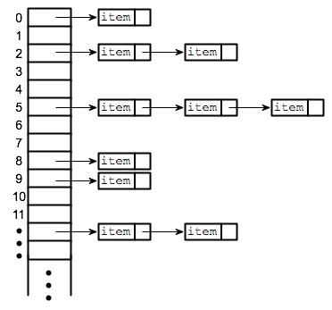

# **Intro to Hash Tables:**

- Hashtables are a data structure that utilize key value pairs. This means every Node or Bucket has both a key, and a value.

- we use them:

  - Hold unique values
  - Dictionary
  - Library

- Some definitions related to hash table:

  - **Hash** - A hash is the result of some algorithm taking an incoming string and converting it into a value that could be used for either security or some other purpose. In the case of a hashtable, it is used to determine the index of the array.
  - **Buckets** - A bucket is what is contained in each index of the array of the hashtable. Each index is a bucket. An index could potentially contain multiple key/value pairs if a collision occurs.
  - **Collisions** - A collision is what happens when more than one key gets hashed to the same location of the hashtable.

- Hash maps do this to read value:
  - accept a key
  - calculate the hash of the key
  - use modulus to convert the hash into an array index
  - use the array index to access the short LinkedList representing a bucket
  - search through the bucket looking for a node with a key/value pair that matches the key you were given

## Sources:

- (1) [Hashtables](https://codefellows.github.io/common_curriculum/data_structures_and_algorithms/Code_401/class-30/resources/Hashtables.html)

[Back to home page](../README.md)
