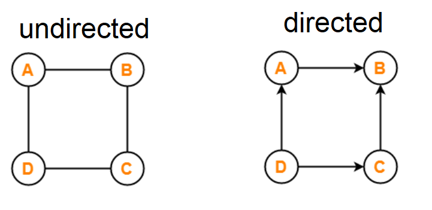
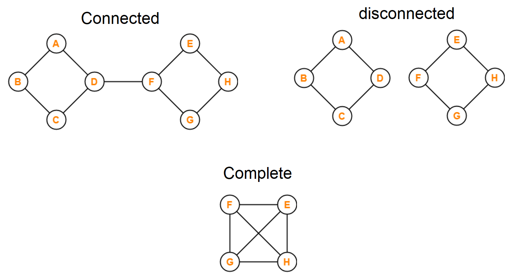
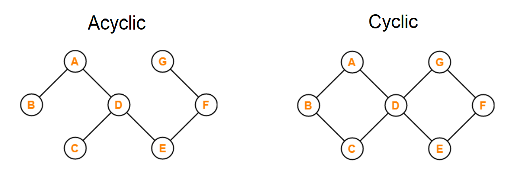

# **Graphs:**

- > A graph is a non-linear data structure that can be looked at as a collection of vertices (or nodes) potentially connected by line segments named edges(1)

- Terminology:(1)

  - **Vertex** -called a “node”, is a data object that can have zero or more adjacent vertices.
  - **Edge** - is a connection between two nodes.
  - **Neighbor** - its adjacent nodes, i.e., are connected via an edge.
  - **Degree** - is the number of edges connected to that vertex.

- Directed vs Undirected:

  - Undirected: edges of an undirected graph do not contain any direction.
  - Directed: all the edges of a directed graph contain some direction. directed graphs are also called as digraphs.

    

- Complete vs Connected vs Disconnected:

  - Complete: A graph in which exactly one edge is present between every pair of vertices is called as a complete graph.
  - Connected: at least one path exists between every pair of vertices.
  - Disconnected: A graph in which there does not exist any path between at least one pair of vertices.

    

- Acyclic vs Cyclic:

  - Cyclic: A graph containing at least one cycle in it.
  - Acyclic: A graph not containing any cycle in it.

    

- Real World Uses of Graphs:(1)

  - GPS and Mapping
  - Driving Directions
  - Social Networks
  - Airline Traffic
  - Netflix uses graphs for suggestions of products

## Sources:

- (1) [Graphs](https://codefellows.github.io/common_curriculum/data_structures_and_algorithms/Code_401/class-35/resources/graphs.html)
- (2) [Types of Graphs in Graph Theory](https://www.gatevidyalay.com/tag/disconnected-graph-example/)

[Back to home page](../README.md)
